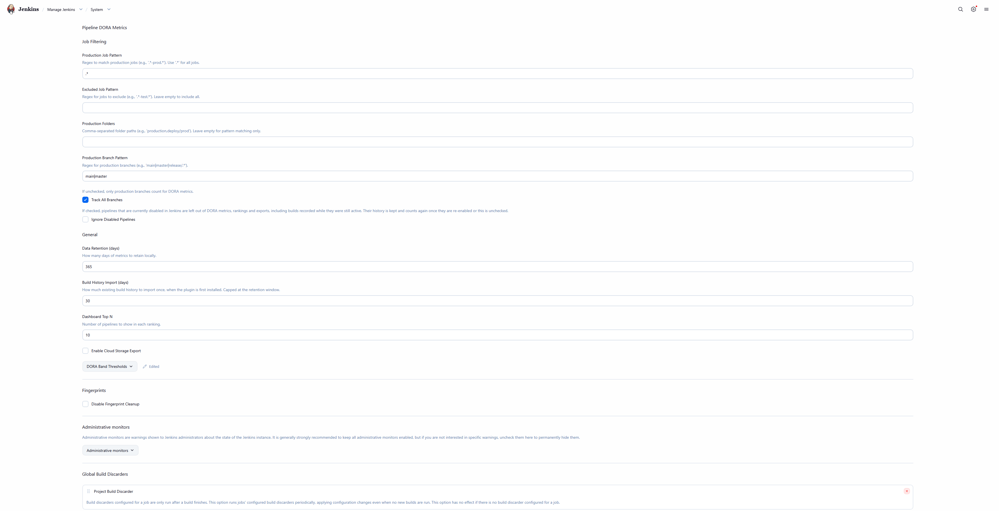

# Pipeline DORA Metrics

A Jenkins plugin that tracks all four DORA metrics, pipeline analytics, rankings, and performance trends. No external infrastructure required.


## Features

**DORA Metrics (All 4)**
- Deployment Frequency with DORA band rating (Elite/High/Medium/Low)
- Lead Time for Changes (commit to deploy)
- Mean Time to Restore (failure to recovery)
- Change Failure Rate (% failed deployments)

**Pipeline Rankings and Stage Analytics**


- Slowest pipelines by average duration
- Most failing pipelines by failure rate
- Most improved (month-over-month duration change)
- Flakiest pipelines (pass-fail-pass pattern detection)
- Slowest and most failing stages across all pipelines

**Per-Job Metrics**


- Per-job DORA Metrics tab on every job page
- Stage breakdown with duration and run counts

**Dashboard**
- Interactive Chart.js trend charts (build volume, duration over time)
- Sparkline trends on each DORA metric card
- Date range picker (7d / 30d / 90d / 180d / 1y / custom date range)
- Collapsible sections with chevron indicators
- Job drill-down links (click any pipeline to see its per-job metrics)
- CSV and JSON export
- Permission-aware: users only see jobs they have access to

**Configuration**




- Production job pattern (regex)
- Excluded job pattern (regex)
- Folder-based job selection
- Branch filtering (main/master or custom)
- Customizable DORA band thresholds
- Cloud storage export (S3-compatible, HTTP endpoint) with Jenkins Credentials

**Permission-Aware Dashboard**


Rankings only show jobs the current user has access to. Users with limited permissions see a filtered view.

**REST API**
```
GET /dora-api/overview?days=30          All 4 DORA metrics
GET /dora-api/pipelines?days=30&limit=10   Pipeline rankings
GET /dora-api/trends?days=90&job=my-pipeline   Time-series trend data
GET /dora-api/export?days=90&format=csv    CSV/JSON bulk export
```

## How It Works

The plugin uses a `RunListener` to automatically capture build data after every pipeline completes. Data is stored in an embedded SQLite database at `JENKINS_HOME/pipeline-dora-metrics/metrics.db`. No external database setup required.

**Data captured per build:**
- Job name, build number, timestamp, duration, result
- Trigger type (user, SCM, timer, upstream)
- Branch name (from environment variables)
- Stage-level duration and result for each pipeline stage
- SCM commit data for lead time calculation

**Storage:** ~200 bytes per build with stages. 100 builds/day for a year is approximately 7MB.

| Scale | Builds/day | Storage/year |
|-------|-----------|--------------|
| Small team (10 jobs) | 50 | ~3.5MB |
| Medium (50 jobs) | 200 | ~14MB |
| Large (200 jobs) | 1000 | ~70MB |
| Enterprise (1000 jobs) | 5000 | ~350MB |

## Configuration

Navigate to **Manage Jenkins > System** and scroll to the **Pipeline DORA Metrics** section.

**Job Filtering:**
- **Production Job Pattern:** Regex to match production jobs (e.g., `production/.*` or `.*-prod.*`). Default: `.*` (all jobs)
- **Excluded Job Pattern:** Regex to exclude jobs (e.g., `.*-test.*|.*sandbox.*`)
- **Ignore Disabled Pipelines:** Leave pipelines that are currently disabled in Jenkins out of DORA metrics, rankings and exports, including builds recorded while they were still active. Off by default. Their history is kept, so re-enabling a pipeline or unchecking the option brings its numbers back. A pipeline counts as disabled when Jenkins reports it as not buildable: disabled by hand, or a multibranch branch or pull request job kept after its branch was deleted.
- **Production Folders:** Comma-separated Jenkins folder paths (e.g., `production,deploy/prod`)
- **Production Branch Pattern:** Regex for branches that count as production (e.g., `main|master|release/.*`)

**Build History Import:**
- **Build History Import (days):** How much existing build history to import once, the first time the plugin runs. Default: `30`. Capped at the retention window, so it never imports builds the next cleanup would delete. Set it before the first import runs, since the import only happens once.

**DORA Thresholds:** Customize the Elite/High/Medium/Low band boundaries for each metric to match your team's standards.

## Architecture

```
io.jenkins.plugins.dorametrics/
├── collectors/
│   ├── BuildDataCollector      # RunListener - captures builds, stages, commits
│   └── JobRenameListener       # ItemListener - tracks job renames/moves
├── dora/
│   └── DoraCalculator          # Computes all 4 DORA metrics (SQL-optimized)
├── export/
│   ├── ExportStorageConfig     # Describable base for storage backends
│   ├── S3ExportConfig          # S3-compatible storage (AWS, B2, MinIO)
│   └── HttpExportConfig        # HTTP endpoint export
├── rankings/
│   └── PipelineRanker          # Pipeline and stage rankings (SQL aggregates)
├── store/
│   ├── MetricsStore            # SQLite database
│   ├── MetricsExporter         # Builds snapshots, delegates upload to config
│   └── MetricsMaintenanceTask  # Scheduled cleanup and export
├── ui/
│   ├── DoraApiAction           # REST API at /dora-api/ (auth-protected)
│   ├── DoraDashboardAction     # Dashboard UI at /dora-metrics/
│   ├── DoraDashboardLink       # Manage Jenkins sidebar link
│   └── JobMetricsAction        # Per-job metrics tab
├── util/
│   └── DurationFormatter       # Shared duration formatting
└── DoraGlobalConfiguration     # Plugin settings
```

## Security

- All API endpoints require Jenkins READ permission
- Dashboard rankings filtered by Item.READ (users only see jobs they can access)
- Export credentials managed through Jenkins Credentials plugin (encrypted, auditable)
- SQL queries use parameterized statements (no SQL injection)
- CSV export protects against CSV injection attacks
- SQL ORDER BY clauses are whitelisted (not user-controlled)

## Roadmap

**v1.1 (Planned)**
- Additional export backends (GCS, Azure Blob) and IAM role support for S3
- Historical build import (backfill metrics from existing Jenkins build history)
- Grafana dashboard template (JSON) that consumes the REST API

**v1.2 (Planned)**
- Month-over-month comparison view (side-by-side metrics)
- DORA band progression chart (track your team's improvement over time)
- Stage failure heatmap visualization
- Webhook notifications when DORA bands change (Slack, Teams, email)

**v2.0 (Future)**
- Multi-controller aggregation (combine metrics across Jenkins instances)
- Team/group-level DORA metrics (assign jobs to teams)
- GitHub Actions and GitLab CI support (beyond Jenkins)
- Connection pooling with HikariCP for enterprise scale

## Contributing

Issues and pull requests are welcome. Read [CONTRIBUTING.md](CONTRIBUTING.md) first: it covers how to build and test, what a pull request needs, how releases happen, and the rules for AI-assisted contributions. Coding agents should also read [AGENTS.md](AGENTS.md).

## License

MIT
