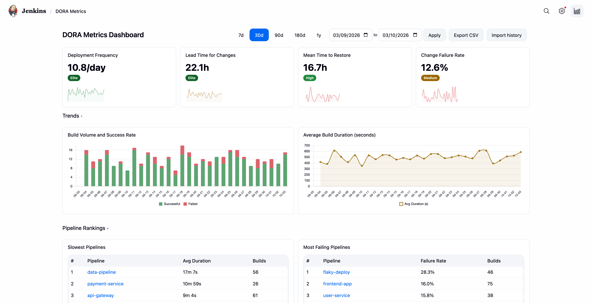
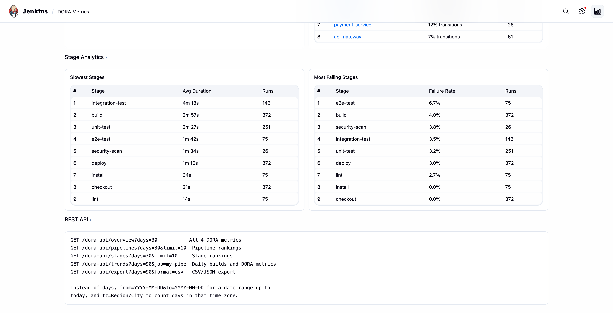
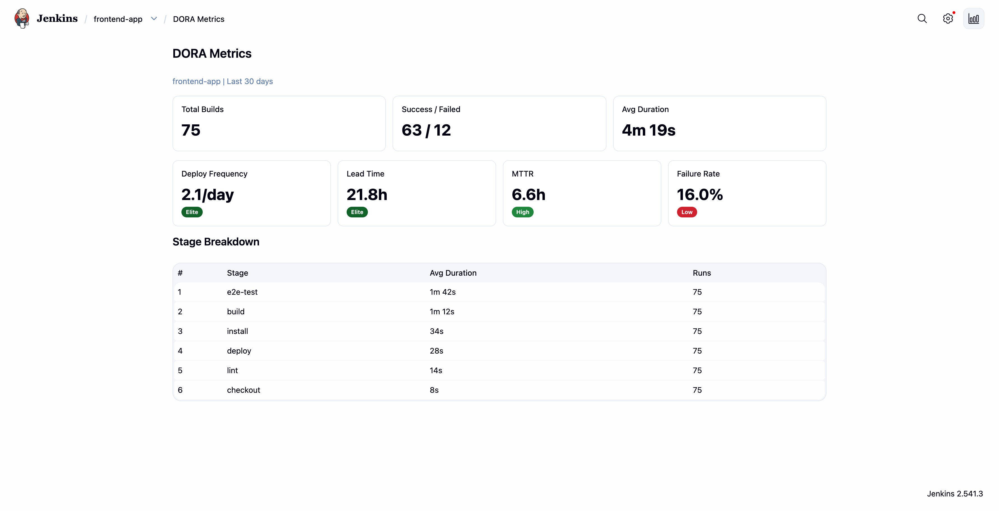
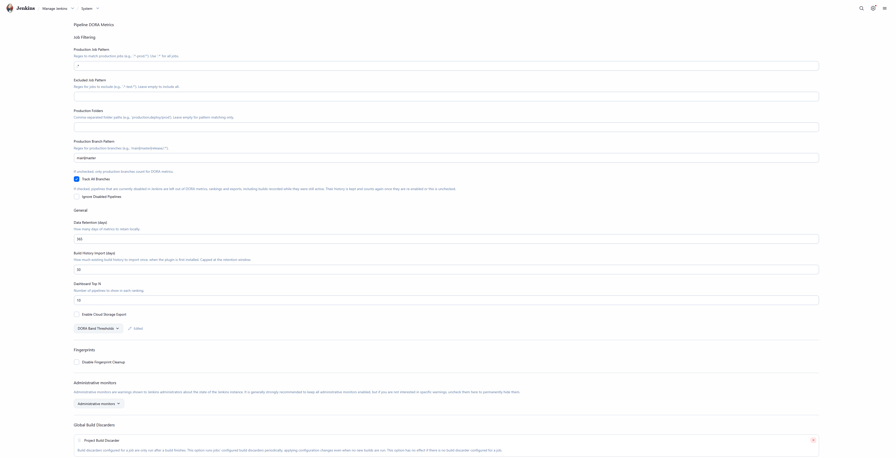
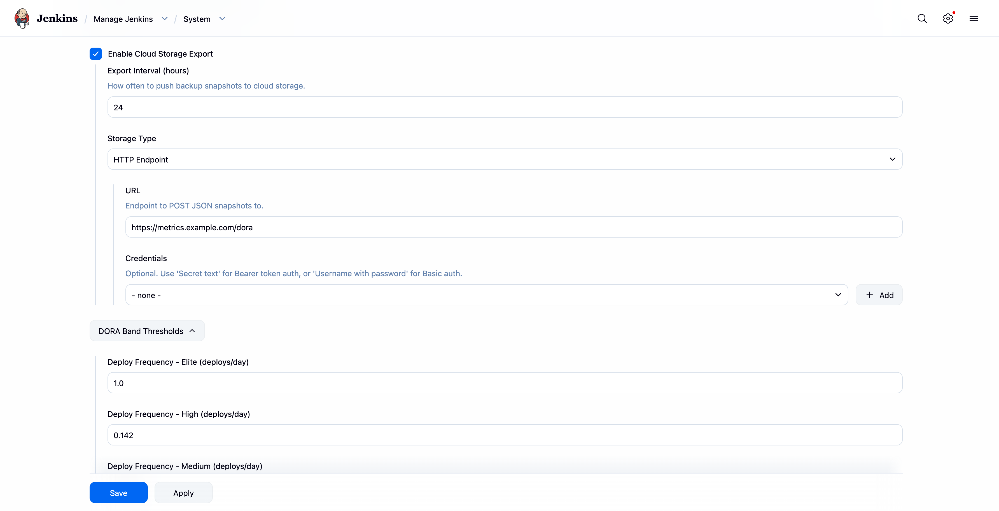
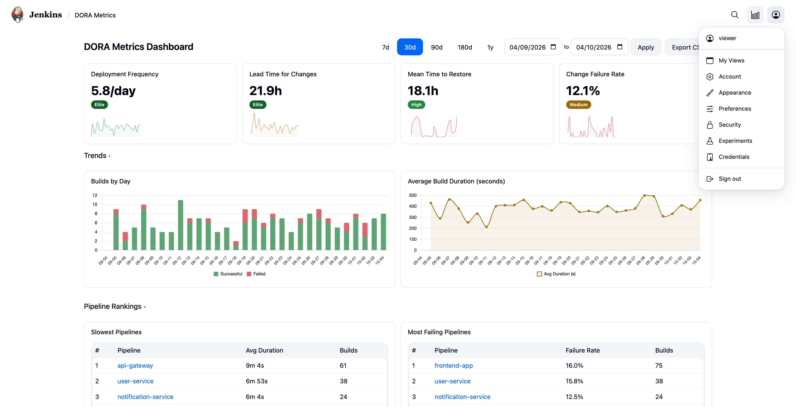

# Pipeline DORA Metrics

A Jenkins plugin that works out the four DORA metrics and other pipeline metrics from the builds Jenkins already runs. It ranks pipelines and stages by failure rate and duration, so failing pipelines and slow stages are easy to find, and charts successful and failed builds by day. Everything stays in a SQLite file in `JENKINS_HOME`, with a REST API and CSV export on top. No external infrastructure required.



## Features

**DORA Metrics (All 4)**
- Deployment Frequency: successful builds of tracked jobs per day
- Lead Time for Changes: from the earliest commit since the job's previous successful build to the end of the next successful build
- Mean Time to Restore: from the start of a job's first failed build to the end of the build that fixed it. Unstable and aborted builds neither start nor end it, and a failure not fixed yet is not counted
- Change Failure Rate: failed builds as a share of successful, unstable and failed ones. Aborted builds are left out
- Each one rated Elite, High, Medium or Low against thresholds you can change

Every successful build of a tracked job counts as a deployment. With the defaults that is every job on every branch, including CI and pull request builds, so point the job, folder and branch settings below at the jobs that deploy.

Lead time is worked out per job from that job's own changelogs. A deploy job that does not check out the code has no commits, so it counts as deployments but adds no lead time, and lead time comes from the tracked job that checked the change out.

**Build History Import**
- Imports builds already on disk, once, the first time the plugin runs, so a new install is not an empty dashboard
- Recovers builds that a job filter excluded at the time, which widening the filter alone cannot do
- Re-runnable on demand from the dashboard by an administrator
- Imported builds get the same stage and commit collection as builds recorded live

**Pipeline Rankings and Stage Analytics**



- Slowest pipelines by average duration
- Most failing pipelines by failure rate
- Most improved: the biggest drop in average duration against the period of the same length just before, faster jobs only
- Flakiest pipelines: how often the result flips from one finished build to the next, from three builds up
- Slowest and most failing stages across all pipelines

**Per-Job Metrics**



- A DORA Metrics tab on every job the settings track, for the last 30 days
- Stage breakdown with duration and run counts

**Dashboard**
- Interactive Chart.js trend charts (build volume, duration over time)
- A sparkline of each DORA metric, day by day, on its card
- Date range picker (7d / 30d / 90d / 180d / 1y / custom dates up to today). The cards, charts, rankings, stage tables and the CSV link all follow it
- Collapsible sections that also work from the keyboard
- Job drill-down links (click any pipeline to see its per-job metrics)
- CSV download from the dashboard, CSV or JSON from `/dora-api/export`
- Permission-aware: users only see jobs they have access to

**Configuration**





- Production job pattern (regex)
- Excluded job pattern (regex)
- Folder-based job selection
- Branch filtering, off by default
- Customizable DORA band thresholds
- Cloud storage export (S3-compatible, HTTP endpoint) with Jenkins Credentials

**Permission-Aware Dashboard**



Rankings only show jobs the current user has access to. Users with limited permissions see a filtered view.

**REST API**
```
GET /dora-api/overview?days=30                 All 4 DORA metrics
GET /dora-api/pipelines?days=30&limit=10       Pipeline rankings
GET /dora-api/stages?days=30&limit=10          Stage rankings
GET /dora-api/trends?days=90&job=my-pipeline   Every day of the period, with builds and the 4 DORA metrics
GET /dora-api/export?days=90&format=csv        CSV/JSON bulk export
POST /dora-api/importHistory                   Start a build history import (Administer)
GET /dora-api/importStatus                     Counters for the running or last import (Administer)
```

Instead of `days`, the endpoints that take it also take `from=YYYY-MM-DD&to=YYYY-MM-DD` for a range of
dates up to today, and `tz=Region/City` to count days in that time zone. A range given only in part, or a
date that isn't one, gets a 400 with the reason in `error`.

## How It Works

A `RunListener` records every build of a tracked job when it finishes, Pipeline or not. Data is stored in an embedded SQLite database at `JENKINS_HOME/pipeline-dora-metrics/metrics.db`. No external database setup required.

**Data captured per build:**
- Job name, build number, timestamp, duration, result
- Trigger type: USER, UPSTREAM, TIMER, SCM, REMOTE or OTHER from the first cause, or UNKNOWN when there is none
- Branch name, in full, from the build's environment
- Stage-level duration and result for each pipeline stage
- SCM commit data for lead time calculation

**Storage:** about 0.5 KB per build with five stages and two commits, measured on a compacted database of 1,538 builds. Stages and commits are most of it, so a build without them takes less. 100 builds a day come to about 18 MB a year.

| Scale | Builds/day | Storage/year |
|-------|-----------|--------------|
| Small team (10 jobs) | 50 | ~9MB |
| Medium (50 jobs) | 200 | ~36MB |
| Large (200 jobs) | 1000 | ~180MB |
| Enterprise (1000 jobs) | 5000 | ~900MB |

### Build history import

Builds are normally recorded by a `RunListener` as they finish, so nothing that ran before
the plugin was installed is in the store. The first time the plugin runs it imports the
builds already on disk, going back **Build History Import (days)**, capped at the retention
window.

It walks every job newest first and stops at the cutoff, skips builds that are still
running, and skips builds already recorded rather than rewriting them. Job filters apply
exactly as they do for live builds, so an excluded job stays excluded. Whether the import
has run is stored in the configuration, so a restart does not scan again.

An administrator can run it again from **Import history** on the dashboard. There are two
reasons to. Raising **Build History Import (days)** does not reach back on its own, so a
dashboard asked for a year while only thirty days were imported stays empty behind those
thirty days until the import is run again. Widening a job filter has the same problem: a
build that did not match when it ran was never recorded, and widening the pattern alone
does not bring it back.

Re-running still walks every job and loads every build inside the window; what it skips is
the writing, for builds already recorded. So it is safe to run again, but not free, and on a
large instance it is worth leaving to the window you actually need.

An import can only read what Jenkins still has on disk. A job whose build discarder has
already removed old builds cannot be recovered.

## Configuration

Navigate to **Manage Jenkins > System** and scroll to the **Pipeline DORA Metrics** section.

**Job Filtering:**
- **Production Job Pattern:** Regex to match production jobs (e.g., `production/.*` or `.*-prod.*`). Default: `.*` (all jobs)
- **Excluded Job Pattern:** Regex to exclude jobs (e.g., `.*-test.*|.*sandbox.*`)
- **Ignore Disabled Pipelines:** Leave pipelines that are currently disabled in Jenkins out of DORA metrics, rankings and exports, including builds recorded while they were still active. Off by default. Their history is kept, so re-enabling a pipeline or unchecking the option brings its numbers back. A pipeline counts as disabled when Jenkins reports it as not buildable: disabled by hand, or a multibranch branch or pull request job kept after its branch was deleted.
- **Production Folders:** Comma-separated Jenkins folder paths (e.g., `production,deploy/prod`)
- **Track All Branches:** On by default. Turn it off to count only builds on a production branch in the four DORA metrics.
- **Production Branch Pattern:** Regex for the branches that count when **Track All Branches** is off. Default: `main|master`. Branch names are stored in full, `release/1.2` rather than `1.2`, with only the remote that `GIT_BRANCH` starts with, `refs/heads/` or `refs/remotes/<remote>/` removed, and the pattern has to match the whole name, so use `release/.*` rather than `release`.

A job is tracked when its full name matches **Production Job Pattern** or sits under one of the **Production Folders**, and does not match **Excluded Job Pattern**. With the default pattern `.*` every job is tracked and the folders add nothing. With a narrower pattern, the folders bring their jobs in on top of it. The filters apply when a build is recorded and again when data is read, so narrowing them hides stored builds without deleting them.

**Build History Import:**
The import runs once per instance, not once per fresh install. An instance that already had
the plugin and upgrades to this version has nothing recorded from before the upgrade either,
so it imports roughly five minutes after restarting. Builds already in the store are skipped,
so on an instance that has been collecting for a while the run finds little to do.

- **Build History Import (days):** How much existing build history to import. Default: `30`. Capped at the retention window, so it never imports builds the next cleanup would delete. This is not the same as the dashboard date range: the range only displays what has already been imported, so asking the dashboard for a year while this is set to 30 shows thirty days of data and nothing behind it. The import runs once on its own. To cover more history later, raise this and use **Import history** on the dashboard.

**Data and dashboard:**
- **Data Retention (days):** Builds older than this are deleted, checked every hour. Default: `365`. The database file keeps its size after a cleanup and reuses the space.
- **Dashboard Top N:** Rows in each ranking. Default: `10`.

**Cloud Export:** When enabled, sends the builds finished since the last successful export, with their stages, to an S3-compatible bucket or an HTTP endpoint every **Export Interval (hours)**, default `24`. Credentials come from the Jenkins credentials store.

**DORA Thresholds:** The Elite, High and Medium boundaries for each metric. Below Medium is Low.

| Metric | Elite | High | Medium |
|--------|-------|------|--------|
| Deployment frequency, per day | 1 or more | 0.142 or more | 0.033 or more |
| Lead time | under 1 day | under 7 days | under 30 days |
| Time to restore | under 1 hour | under 1 day | under 7 days |
| Change failure rate | 5% or less | 10% or less | 15% or less |

### Configuration as Code

The settings can also be set with JCasC, under `unclassified` and `doraGlobalConfiguration`:

```yaml
unclassified:
  doraGlobalConfiguration:
    productionJobPattern: ".*-prod"
    excludedJobPattern: ".*-scratch"
    trackAllBranches: false
    productionBranchPattern: "main|release/.*"
    retentionDays: 180
    dfEliteThreshold: "2.0"
    cfrMediumPercent: "20.0"
```

Put decimal thresholds in quotes, as the JCasC export writes them. An unquoted decimal such as `2.0` is skipped without an error.

## Architecture

```
io.jenkins.plugins.dorametrics/
├── collectors/
│   ├── BuildDataCollector      # RunListener, hands finished builds to BuildRecorder
│   ├── BuildRecorder           # Records a build with its stages, commits and branch
│   ├── BuildHistoryImporter    # Imports builds already on disk
│   ├── HistoryImportTask       # Runs the first import, once per instance
│   └── JobRenameListener       # ItemListener, keeps history with renamed and moved jobs, detaches it from deleted ones
├── dora/
│   └── DoraCalculator          # The four DORA metrics, for a period or day by day
├── export/
│   ├── ExportStorageConfig     # Describable base for storage backends
│   ├── S3ExportConfig          # S3-compatible storage (AWS, B2, MinIO)
│   ├── HttpExportConfig        # HTTP endpoint export
│   └── ExportHttp              # Timeouts and the Jenkins proxy for both
├── rankings/
│   └── PipelineRanker          # Pipeline and stage rankings
├── store/
│   ├── MetricsStore            # SQLite database
│   ├── MetricsExporter         # Builds snapshots, delegates upload to config
│   ├── MetricsExportTask       # Scheduled export
│   └── MetricsMaintenanceTask  # Hourly retention cleanup
├── ui/
│   ├── DoraApiAction           # REST API at /dora-api/ (auth-protected)
│   ├── DoraDashboardAction     # Dashboard UI at /dora-metrics/
│   ├── DoraDashboardLink       # Entry on the Manage Jenkins page
│   └── JobMetricsAction        # Per-job metrics tab
├── util/
│   ├── DurationFormatter       # Shared duration formatting
│   └── Period                  # The days, or from and to dates, an API request asks for
├── DisabledPipelines           # Which pipelines Jenkins reports as disabled
├── JobFilter                   # Applies the job settings when data is read
├── JobVisibility               # What the current user may see
└── DoraGlobalConfiguration     # Plugin settings
```

## Security

- Read-only API endpoints require Jenkins READ permission
- The build history import endpoints require Jenkins ADMINISTER, and starting an import is POST only
- The import status returns counters only, never job names
- Dashboard rankings filtered by Item.READ (users only see jobs they can access)
- Export credentials come from the Jenkins credentials store, encrypted at rest
- SQL queries use parameterized statements (no SQL injection)
- CSV export protects against CSV injection attacks
- SQL ORDER BY clauses are whitelisted (not user-controlled)

## Roadmap

**Planned**
- Additional export backends (GCS, Azure Blob) and IAM role support for S3
- Grafana dashboard template (JSON) that consumes the REST API

**Later**
- Month-over-month comparison view (side-by-side metrics)
- DORA band progression chart (track your team's improvement over time)
- Stage failure heatmap visualization
- Webhook notifications when DORA bands change (Slack, Teams, email)

**Further out**
- Multi-controller aggregation (combine metrics across Jenkins instances)
- Team/group-level DORA metrics (assign jobs to teams)
- GitHub Actions and GitLab CI support (beyond Jenkins)
- Connection pooling with HikariCP for enterprise scale

## Contributing

Issues and pull requests are welcome. Read [CONTRIBUTING.md](CONTRIBUTING.md) first: it covers how to build and test, what a pull request needs, how releases happen, and the rules for AI-assisted contributions. Coding agents should also read [AGENTS.md](AGENTS.md).

## License

MIT
